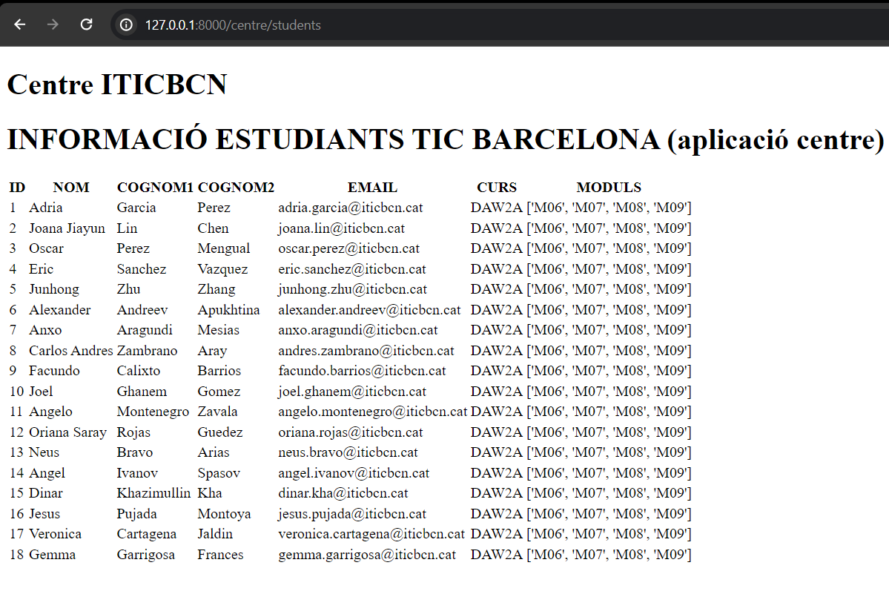
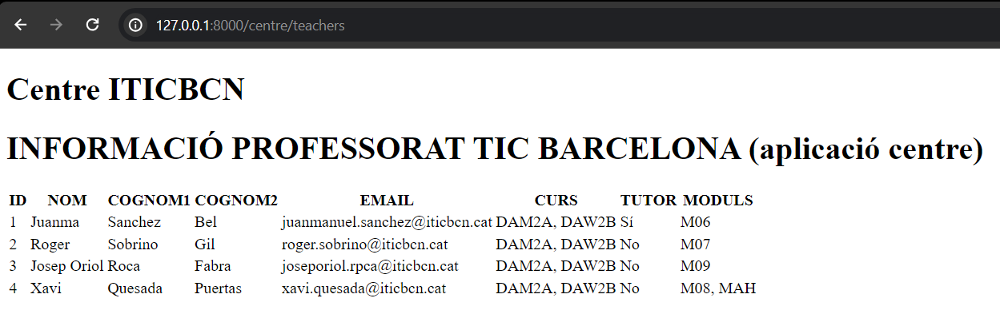
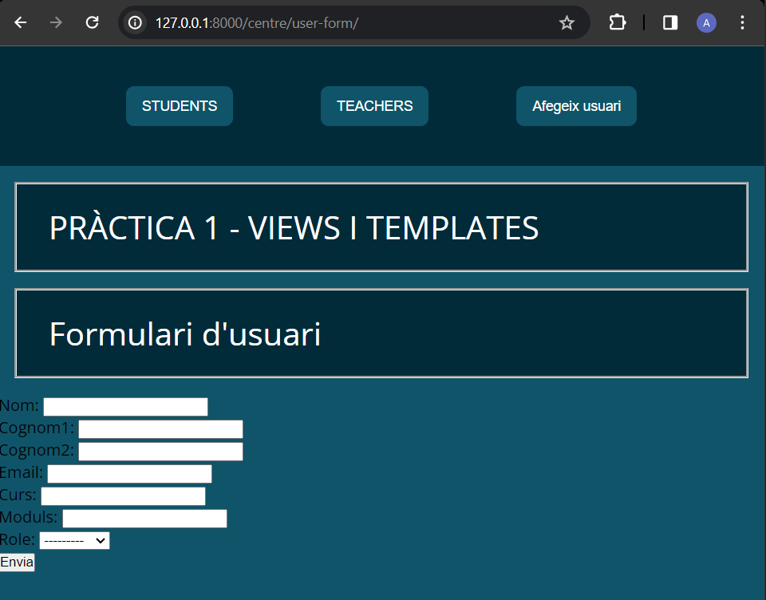
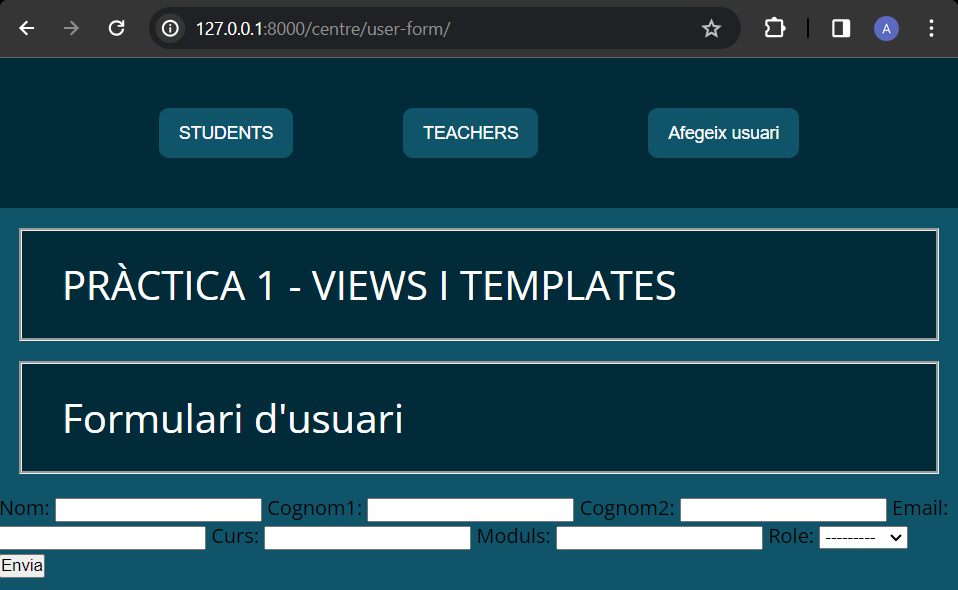

# PRÀCTICA 1

1. Crear un projecte de DJANGO de nom TIC_BCN_inicials alumnat. El nom de l’aplicació a on s’hi afegiran els templates i les views és centre. Es farà una aplicació per mostrar dades de l’alumnat de DAW2B i del seu professorat (dades reals).

- Dades a mostrar alumnat: nom, cognom1, cognom2, correu, curs, mòduls matriculats.
- Dades a mostrar prof.: nom, cognom1, cognom2, correu, curs, tutor(si s’escau),mòduls que imparteix.
- Path alumne: localhost:8000/centre/students
- Path professor: localhost:8000/centre/teachers

Exemple de mostra centre/students:

Exemple de mostra centre/teachers:

2. Modificar l’exercici 1 per a que es vegi com al gif de la diapositiva 7 de TEORIA UF4 - PARÀMETRES I ENLLAÇ. És a dir, ha de tindre una pàgina principal que renderitzi amb el llistat complet de professorat o alumnat i cada professor/a o alumne/a té un enllaç a una pàgina on surt només la seva informació. Cada pàgina ha de tindre un retorn a la pàgina principal.

[Video pràctica 1](https://drive.google.com/file/d/18ZQu0F2-QNDcqpU3wWGG-XTVdXRpjFGz/view?usp=sharing)

# PRÀCTICA 2

1.
    Afegir la part del model a la pràctica 1 connectant amb un PostgreSQL. Es crea la BBDD desde Django, amb Models (NO a pgAdmin4).
        A la base de dades ha d’haver 1 taula amb 6 (mínim id i rol) camps (sense comptar el id ja que es crea automàticament).

<video mostrant que a pgAdmin4 no hi ha bbdd, i una vegada executat el projecte, es mostra pgAdmin4 amb la bbdd creada, la taula i els seus camps.>

[Video pràctica 2](https://drive.google.com/file/d/1FEGNWsyxQVy6IeDwGSOy5uhwOS9o5QjC/view?usp=sharing)

# PRÀCTICA 3

1.
    Crear un formulari (sense funcionalitat) per afegir alumnat i professorat...
- S’ha de tindre una BBDD amb els camps necessaris (sense comptar id). 
- El formulari ha de tindre tots els camps de la taula de la BBDD.

El template del projecte haurà de tindre 2 enllaços (alumnat i professorat) que ja s’han implementat a la pràctica 1, i se li afegirà 1 enllaç més pel formulari. Quan se li doni a l’enllaç del formulari, a sota, s’haurà de renderitzar el formulari. Es podrà utilitzar el formulari fins que se li doni a qualsevol altre enllaç.

#### CAPTURES
##### Amb as_p

##### Sense as_p

